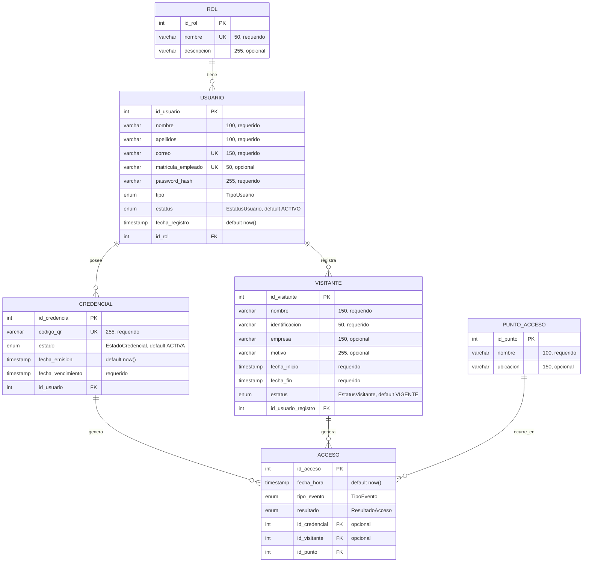

# Base de datos · SICAD

Motor: **PostgreSQL**. El modelo se define en `backend/prisma/schema.prisma` y se despliega
mediante migraciones de Prisma. En producción se monta sobre **Azure Database for PostgreSQL
(Flexible Server)**.

## Diagrama Entidad–Relación

> Un evento de **ACCESO** lo genera **una credencial** (comunidad) **o un visitante** (externo),
> por eso `id_credencial` e `id_visitante` son opcionales (uno u otro).

## Relaciones

| Relación | Cardinalidad | Descripción |
|----------|--------------|-------------|
| ROL → USUARIO | 1 : N | Un rol lo tienen muchos usuarios |
| USUARIO → CREDENCIAL | 1 : N | Un usuario posee una o más credenciales |
| USUARIO → VISITANTE | 1 : N | Un usuario (caseta) registra varios visitantes |
| CREDENCIAL → ACCESO | 1 : N | Una credencial genera muchos eventos de acceso |
| VISITANTE → ACCESO | 1 : N | Un visitante genera muchos eventos de acceso |
| PUNTO_ACCESO → ACCESO | 1 : N | En un punto de acceso ocurren muchos accesos |

## Enumeraciones (tipos)

| Enum | Valores |
|------|---------|
| `TipoUsuario` | ALUMNO, TRABAJADOR, ADMINISTRATIVO, DOCENTE, SEGURIDAD |
| `EstatusUsuario` | ACTIVO, INACTIVO, SUSPENDIDO |
| `EstadoCredencial` | ACTIVA, INACTIVA, VENCIDA, REVOCADA |
| `EstatusVisitante` | VIGENTE, EXPIRADO, CANCELADO |
| `TipoEvento` | ENTRADA, SALIDA |
| `ResultadoAcceso` | PERMITIDO, DENEGADO |

## Diccionario de datos (resumen)

**usuario** — comunidad interna (alumnos y trabajadores)

| Columna | Tipo | Restricción |
|---------|------|-------------|
| id_usuario | serial | PK |
| nombre | varchar(100) | NOT NULL |
| apellidos | varchar(100) | NOT NULL |
| correo | varchar(150) | UNIQUE, NOT NULL |
| matricula_empleado | varchar(50) | UNIQUE, NULL |
| password_hash | varchar(255) | NOT NULL |
| tipo | TipoUsuario | NOT NULL |
| estatus | EstatusUsuario | default ACTIVO |
| fecha_registro | timestamp | default now() |
| id_rol | int | FK → rol.id_rol |

**credencial** — credencial digital con código QR

| Columna | Tipo | Restricción |
|---------|------|-------------|
| id_credencial | serial | PK |
| codigo_qr | varchar(255) | UNIQUE, NOT NULL |
| estado | EstadoCredencial | default ACTIVA |
| fecha_emision | timestamp | default now() |
| fecha_vencimiento | timestamp | NOT NULL |
| id_usuario | int | FK → usuario.id_usuario |

**acceso** — bitácora de eventos de entrada/salida

| Columna | Tipo | Restricción |
|---------|------|-------------|
| id_acceso | serial | PK |
| fecha_hora | timestamp | default now() |
| tipo_evento | TipoEvento | NOT NULL |
| resultado | ResultadoAcceso | NOT NULL |
| id_credencial | int | FK → credencial (NULL) |
| id_visitante | int | FK → visitante (NULL) |
| id_punto | int | FK → punto_acceso.id_punto |

> Las tablas `rol`, `visitante` y `punto_acceso` siguen el mismo patrón; ver el detalle completo
> de tipos y restricciones en `backend/prisma/schema.prisma` (fuente única de verdad).

## Despliegue en Azure

- **Servicio:** Azure Database for PostgreSQL — Flexible Server (tier Burstable B1ms para el proyecto).
- **Conexión:** el backend se conecta mediante la variable `DATABASE_URL` (misma que en local/Docker).
- **Migraciones:** al desplegar, se ejecuta `npx prisma migrate deploy` para crear/actualizar el esquema.
- **Respaldos:** el Flexible Server incluye respaldos automáticos administrados por Azure.

> El diagrama Mermaid de arriba se renderiza automáticamente en GitHub y en VS Code (con la extensión Mermaid).
